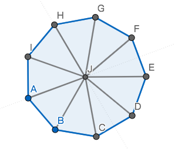
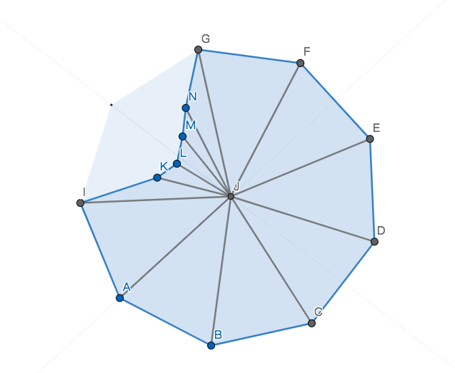
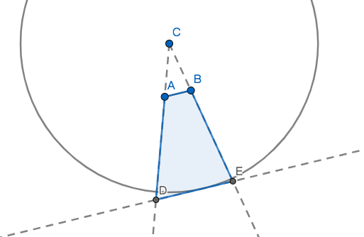

## 关于Deferred light / Forward light
了解3d游戏中光照的人，应该很熟悉deferred和forward这两种不同的实现方式。

简而言之，deferred light是以这种方式绘制的：  

1. 对每一个场景中的Mesh
   1. 将其法线绘制到法线贴图上
   2. 将其颜色绘制到颜色贴图上
   3. 将其深度绘制到深度贴图上
2. 对每一个灯光，对三张贴图进行采样，绘制到屏幕上。

而forward light是以这种方式绘制的：

1. 对每一个场景中的Mesh，对每一个灯光, 将其绘制到屏幕上

最直接的差别是，对于数量为M的Mesh，数量为L的光源而言，deferred light的draw call次数为`O(M + L)`，而forward light 为`O(ML)`。

在2d光照中也可以用同样的概念去理解，可以用deferred及forward两种不同的方式去实现。

我最终选择了deferred的方式去实现，像这样：

1. 对每一个光源，如果没有被剔除（在摄像机外），则将其光照绘制到一个等同屏幕比例的光照贴图上。
2. 在绘制场景完中每一个精灵（Sprite）/粒子/骨骼动画以后，将光照贴图以一个quad mesh的方式绘制到屏幕上，使用相乘的blend方式。

这样可以保证我可以方便地在任意一个已开发到一定复杂度的游戏中加入这个光照系统，而无需改动场景中原来任意Renderer的绘制Shader。

同时为了光照能够让场景中的物体呈现不同的细节，我们可以很方便地加入法线贴图，具体可以参考[这篇文章](http://www.wholehog-games.com/devblog/2013/06/07/lighting-in-a-2d-game/)。

## 硬阴影
两年以前，我实现了一个只有硬光源的简陋光照系统。

那个时候，我主要受到[这篇文章](https://ncase.me/sight-and-light/)的启发，学习到如何用线性及二分的`Raycast`来获得周围遮挡体的轮廓和边缘。

不过我的思路也局限于此，当时完全想不出如何绘制一个过渡足够平滑的阴影边缘。

那个时候，在将光源绘制到光照贴图这一步上，我是这么做的（只考虑点光源）：

1. 均匀地用`Raycast`遍历光源周围，对突变（两条射线的终点不是同一个碰撞体或是法线的差距很大）的地方进行二分，得到在极坐标上的遮挡点信息。
2. 生成一个光照Mesh。例如，一个没有任何遮挡的点光源会生成一个近似圆形的Mesh：
  
而有遮挡的光源会生成一个残缺的Mesh：
  
上图中NMLK点与GFED等点本质上并没有什么不同，只不过NMLK在`Raycast`中击中了实在的碰撞体，而GFED在达到光源范围最远处时击中了“假想碰撞体”。
3. 因为光源的强度会随距离衰减，我们为光照Mesh中不同的顶点赋值不同的颜色值使之中心最亮，边缘最暗（2d中的光源，线性衰减效果已经足够好）。

其中获取周围遮挡点的实现可以参考：
```csharp
public class CircleHitPoint {
	public float radius;
	public LayerMask colliderLayer;
    public float binaryMaxDegree = 5;
	public int rayCount;
	public Vector2 center;
	public struct HitInfo {
		public RaycastHit2D hit2D;
		public float angle;

        public HitInfo(RaycastHit2D hit2D, float angle)
        {
            this.hit2D = hit2D;
            this.angle = angle;
        }
		public Vector2 Position(Vector2 center, float radius) {
			if(hit2D) {
				return hit2D.point;
			}
			else {
				return center + CircleHitPoint.Degree2Dir(angle) * radius;
			}
		}
    }
	
	private static Vector2 Degree2Dir(float degree) {
		float rayRad = Mathf.Deg2Rad * degree;
		Vector2 dir = new Vector2(Mathf.Cos(rayRad), Mathf.Sin(rayRad));
		return dir;
	}
	private RaycastHit2D AngleRayCast(float angle) {
		var rayDir = Degree2Dir(angle);
		var hit = Physics2D.Raycast(center, rayDir, radius, colliderLayer);
		return hit;
	}
	public Vector2 Position(HitInfo info) {
		return info.Position(center, radius);
	}
	public float NormedHitRadius(HitInfo info) {
		return Mathf.Clamp01((Position(info) - center).magnitude / radius);
	}
	private IEnumerable<HitInfo> BinaryFindEdgeAndReturnPoint(HitInfo info1, HitInfo info2) {
		if(rayCount < 3) rayCount = 3;
		Func<RaycastHit2D, RaycastHit2D, bool> hitSame = (hit1, hit2) => {
			if(!hit1 && !hit2) {
				return true;
			}
			else if(hit1 ^ hit2) {
				return false;
			}
			else {
				return hit1.collider == hit2.collider;
			}
		};
		Func<RaycastHit2D, RaycastHit2D, bool> normalSame = (hit1, hit2) => {

			return (!hit1 && !hit2) || Mathf.Approximately((hit1.normal - hit2.normal).magnitude, 0);
		};
		if((hitSame(info1.hit2D, info2.hit2D) && normalSame(info1.hit2D, info2.hit2D)) 
			|| info2.angle - info1.angle < binaryMaxDegree) {
			yield return new HitInfo(info2.hit2D, info2.angle);
			yield break;
		}
		var midDegree = (info1.angle + info2.angle) / 2;
		var midHit = AngleRayCast(midDegree);
		var midHitInfo = new HitInfo(midHit, midDegree);
		foreach(var hitInfo in BinaryFindEdgeAndReturnPoint(info1, midHitInfo)) {
			yield return hitInfo;
		}
		foreach(var hitInfo in BinaryFindEdgeAndReturnPoint(midHitInfo, info2)) {
			yield return hitInfo;
		}
	}
    //返回每个遮挡点
    public IEnumerable<HitInfo> RaycastPoints() {
        float deltaDegree = 360.0f / (float) rayCount;    
        float lastDegree = 0;
        RaycastHit2D lastHit = new RaycastHit2D();
        for(int i = 0; i < rayCount + 1; i++) {
            float rayDegree = deltaDegree * i;
            var hit = AngleRayCast(rayDegree);
            if(i > 0) {
                var lastHitInfo = new HitInfo(lastHit, lastDegree);
                var currentHitInfo = new HitInfo(hit, rayDegree);
                var hitInfos = BinaryFindEdgeAndReturnPoint(lastHitInfo, currentHitInfo);
				foreach(var hitInfo in hifInfos) {
					yield return hitInfo;
				}
            }
            else {
				yield return new HitInfo(hit, rayDegree);
            }
            lastHit = hit;
            lastDegree = rayDegree;

        }
    }
}
```

这种方式用来做硬阴影的效果非常好，也很简单，我一度觉得这是最终的解决方案。

在后续实现软阴影的时候，我没有放弃这个做法，而是在绘制完整个光照贴图以后，对光照贴图做了一次高斯模糊（其实更好的做法是对每个光源绘制的光照进行光照朝向的法线模糊）。

然而高斯模糊的开销非常大，导致游戏在一些对后处理支持的不是很好的平台上奇慢无比（之前在开发的一个采用模糊的方式来实现软阴影的游戏在我的Macbook Pro上只有20FPS）。

这使我回过头来思考：对于2d遮挡的软阴影，有没有更好更快的实现方式？

之后我看到了GameDev.net上的[这篇文章](http://archive.gamedev.net/archive/reference/programming/features/2dsoftshadow/)，让我一拍脑袋。原来没有必要一次性将光照画出来，而是可以分为几步：

1. Clear阴影贴图（一张单通道的，等同屏幕比例的贴图）
2. 对每个光源：
   1. 绘制该光源造成的阴影到阴影贴图上
   2. 将光源绘制到光照贴图上（同时对阴影贴图进行采样）

原文中，所谓的阴影贴图即是光照贴图的Alpha通道，然而我在unity中做不到只Clear一张贴图的Alpha通道，所以我选择创建一张只有R通道的贴图作为阴影贴图。

我从中还得到的一个提示是：每个阴影区块的绘制，是以遮挡体（Shadow hull)的一条边为单位的。

什么意思？举个例子，假设我要绘制一条边AB的硬阴影，我生成这样一张阴影Mesh：
  

其中DE是AB的平行线，圆的半径是光源的最大衰减距离（该距离外不绘制光照）。原文中的做法是将DE边投射得足够远直至大于屏幕宽度，而我这边的做法是将其投射至光源最大衰减距离处，也就是说DE是该圆的切线。

具体的Mesh生成代码如下：

```csharp
void UpdateShadowMesh() {
    if(shadowMesh == null) shadowMesh = new Mesh();
    shadowMesh.MarkDynamic();
    shadowMesh.Clear();
    List<Vector3> vertices = new List<Vector3>();
    List<int> triangles = new List<int>();
    CircleHitPoint.HitInfo? previous = null;
    foreach(var current in circleHitPoint.RaycastPoints()) {
        if(!current.hit2D) {
            previous = null;
        }
        else {
            if(previous != null) {
                // Consume previous is A, current is B
                if(previous.Value.hit2D.collider == current.hit2D.collider) {
                    Vector2 A = circleHitPoint.Position(previous.Value);
                    Vector2 B = circleHitPoint.Position(current);
                    Vector2 C = circleHitPoint.center;
                    Vector2 AB = B - A;
                    Vector2 normal = new Vector2(AB.y, -AB.x).normalized;
                    Vector2 CA = A - C;
                    float dis = Vector2.Dot(CA, normal);
                    float scale = circleHitPoint.radius / dis;
                    Func<Vector2, Vector2> project = v2 => (v2 - C) * scale + C;
                    triangles.Add(vertices.Count + 0);
                    triangles.Add(vertices.Count + 3);
                    triangles.Add(vertices.Count + 2);
                    triangles.Add(vertices.Count + 0);
                    triangles.Add(vertices.Count + 1);
                    triangles.Add(vertices.Count + 3);
                    vertices.Add(WorldV2ToLocalV3(A));
                    vertices.Add(WorldV2ToLocalV3(B));
                    vertices.Add(WorldV2ToLocalV3(project(A)));
                    vertices.Add(WorldV2ToLocalV3(project(B)));
                }
            }
            previous = current;
        }
    }
    shadowMesh.SetVertices(vertices);
    shadowMesh.SetTriangles(triangles, 0);
    shadowMesh.RecalculateNormals();
}
```

代码中的数学计算很简单，参照图示应该很好理解。

在绘制光源时对阴影贴图采样，令光照值和阴影值相乘，绘制到光照贴图上。

由于我们不再通过Mesh顶点的颜色来传递光照距离缩减，我们每个光源可以用一张简单的quad mesh来绘制，而光照距离衰减在fragment shader中解决。

点光源的fragment shader是这样的：

```c
float4 frag(v2f IN) : COLOR
{
    float2 dir = IN.world - _LightPos;
    float norm = length(dir) / _LightMaxDis;
    norm = saturate(norm);
    float4 c = float4(_LightColor.xyz * smoothstep(0, 1, (1 - norm)), 1);
    c.xyz *= 1 - tex2D(_ShadowMap, IN.screen.xy).r;
    return c;
}
```

阴影贴图是反色绘制的（阴影处是白，非阴影处是黑，这样可以简单地Blend add），所以在采样相乘的时候需要`1 - c.r`来反色回去。而光照距离衰减我用了一个smoothstep函数使之更加平滑。

