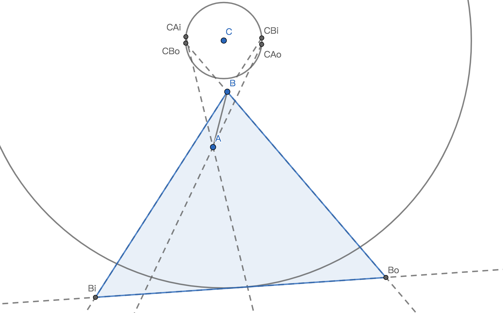

## 关于Deferred light / Forward light
了解3d游戏中光照的人，应该很熟悉deferred和forward这两种不同的实现方式。

简而言之，deferred light是以这种方式绘制的：  

1. 对每一个场景中的Mesh
   1. 将其法线绘制到法线贴图上
   2. 将其颜色绘制到颜色贴图上
   3. 将其深度绘制到深度贴图上
2. 对每一个灯光，对三张贴图进行采样，绘制到屏幕上。

而forward light是以这种方式绘制的：

1. 对每一个场景中的Mesh，对每一个灯光, 将其绘制到屏幕上

最直接的差别是，对于数量为M的Mesh，数量为L的光源而言，deferred light的draw call次数为`O(M + L)`，而forward light 为`O(ML)`。

在2d光照中也可以用同样的概念去理解，可以用deferred及forward两种不同的方式去实现。

我最终选择了deferred的方式去实现，像这样：

1. 对每一个光源，如果没有被剔除（在摄像机外），则将其光照绘制到一个等同屏幕比例的光照贴图上。
2. 在绘制场景完中每一个精灵（Sprite）/粒子/骨骼动画以后，将光照贴图以一个quad mesh的方式绘制到屏幕上，使用相乘的blend方式。

这样可以保证我可以方便地在任意一个已开发到一定复杂度的游戏中加入这个光照系统，而无需改动场景中原来任意Renderer的绘制Shader。

同时为了光照能够让场景中的物体呈现不同的细节，我们可以很方便地加入法线贴图，具体可以参考[这篇文章](http://www.wholehog-games.com/devblog/2013/06/07/lighting-in-a-2d-game/)。

## 硬阴影
两年以前，我实现了一个只有硬光源的简陋光照系统。

那个时候，我主要受到[这篇文章](https://ncase.me/sight-and-light/)的启发，学习到如何用线性及二分的`Raycast`来获得周围遮挡体的轮廓和边缘。

不过我的思路也局限于此，当时完全想不出如何绘制一个过渡足够平滑的阴影边缘。

那个时候，在将光源绘制到光照贴图这一步上，我是这么做的（只考虑点光源）：

1. 均匀地用`Raycast`遍历光源周围，对突变（两条射线的终点不是同一个碰撞体或是法线的差距很大）的地方进行二分，得到在极坐标上的遮挡点信息。
2. 生成一个光照Mesh。例如，一个没有任何遮挡的点光源会生成一个近似圆形的Mesh：
  
而有遮挡的光源会生成一个残缺的Mesh：
  
上图中`NMLK`点与`GFED`等点本质上并没有什么不同，只不过NMLK在`Raycast`中击中了实在的碰撞体，而GFED在达到光源范围最远处时击中了“假想碰撞体”。
3. 因为光源的强度会随距离衰减，我们为光照Mesh中不同的顶点赋值不同的颜色值使之中心最亮，边缘最暗（2d中的光源，线性衰减效果已经足够好）。

其中获取周围遮挡点的实现可以参考：
```csharp
public class CircleHitPoint {
	public float radius;
	public LayerMask colliderLayer;
    public float binaryMaxDegree = 5;
	public int rayCount;
	public Vector2 center;
	public struct HitInfo {
		public RaycastHit2D hit2D;
		public float angle;

        public HitInfo(RaycastHit2D hit2D, float angle)
        {
            this.hit2D = hit2D;
            this.angle = angle;
        }
		public Vector2 Position(Vector2 center, float radius) {
			if(hit2D) {
				return hit2D.point;
			}
			else {
				return center + CircleHitPoint.Degree2Dir(angle) * radius;
			}
		}
    }
	
	private static Vector2 Degree2Dir(float degree) {
		float rayRad = Mathf.Deg2Rad * degree;
		Vector2 dir = new Vector2(Mathf.Cos(rayRad), Mathf.Sin(rayRad));
		return dir;
	}
	private RaycastHit2D AngleRayCast(float angle) {
		var rayDir = Degree2Dir(angle);
		var hit = Physics2D.Raycast(center, rayDir, radius, colliderLayer);
		return hit;
	}
	public Vector2 Position(HitInfo info) {
		return info.Position(center, radius);
	}
	public float NormedHitRadius(HitInfo info) {
		return Mathf.Clamp01((Position(info) - center).magnitude / radius);
	}
	private IEnumerable<HitInfo> BinaryFindEdgeAndReturnPoint(HitInfo info1, HitInfo info2) {
		if(rayCount < 3) rayCount = 3;
		Func<RaycastHit2D, RaycastHit2D, bool> hitSame = (hit1, hit2) => {
			if(!hit1 && !hit2) {
				return true;
			}
			else if(hit1 ^ hit2) {
				return false;
			}
			else {
				return hit1.collider == hit2.collider;
			}
		};
		Func<RaycastHit2D, RaycastHit2D, bool> normalSame = (hit1, hit2) => {

			return (!hit1 && !hit2) || Mathf.Approximately((hit1.normal - hit2.normal).magnitude, 0);
		};
		if((hitSame(info1.hit2D, info2.hit2D) && normalSame(info1.hit2D, info2.hit2D)) 
			|| info2.angle - info1.angle < binaryMaxDegree) {
			yield return new HitInfo(info2.hit2D, info2.angle);
			yield break;
		}
		var midDegree = (info1.angle + info2.angle) / 2;
		var midHit = AngleRayCast(midDegree);
		var midHitInfo = new HitInfo(midHit, midDegree);
		foreach(var hitInfo in BinaryFindEdgeAndReturnPoint(info1, midHitInfo)) {
			yield return hitInfo;
		}
		foreach(var hitInfo in BinaryFindEdgeAndReturnPoint(midHitInfo, info2)) {
			yield return hitInfo;
		}
	}
    //返回每个遮挡点
    public IEnumerable<HitInfo> RaycastPoints() {
        float deltaDegree = 360.0f / (float) rayCount;    
        float lastDegree = 0;
        RaycastHit2D lastHit = new RaycastHit2D();
        for(int i = 0; i < rayCount + 1; i++) {
            float rayDegree = deltaDegree * i;
            var hit = AngleRayCast(rayDegree);
            if(i > 0) {
                var lastHitInfo = new HitInfo(lastHit, lastDegree);
                var currentHitInfo = new HitInfo(hit, rayDegree);
                var hitInfos = BinaryFindEdgeAndReturnPoint(lastHitInfo, currentHitInfo);
				foreach(var hitInfo in hifInfos) {
					yield return hitInfo;
				}
            }
            else {
				yield return new HitInfo(hit, rayDegree);
            }
            lastHit = hit;
            lastDegree = rayDegree;

        }
    }
}
```

这种方式用来做硬阴影的效果非常好，也很简单，我一度觉得这是最终的解决方案。

在后续实现软阴影的时候，我没有放弃这个做法，而是在绘制完整个光照贴图以后，对光照贴图做了一次高斯模糊（其实更好的做法是对每个光源绘制的光照进行光照朝向的法线模糊）。

然而高斯模糊的开销非常大，导致游戏在一些对后处理支持的不是很好的平台上奇慢无比（之前在开发的一个采用模糊的方式来实现软阴影的游戏在我的Macbook Pro上只有20FPS）。

这使我回过头来思考：对于2d遮挡的软阴影，有没有更好更快的实现方式？

之后我看到了GameDev.net上的[这篇文章](http://archive.gamedev.net/archive/reference/programming/features/2dsoftshadow/)，让我一拍脑袋。原来没有必要一次性将光照画出来，而是可以分为几步：

1. Clear阴影贴图（一张单通道的，等同屏幕比例的贴图）
2. 对每个光源：
   1. 绘制该光源造成的阴影到阴影贴图上
   2. 将光源绘制到光照贴图上（同时对阴影贴图进行采样）

原文中，所谓的阴影贴图即是光照贴图的Alpha通道，然而我在unity中做不到只Clear一张贴图的Alpha通道，所以我选择创建一张只有R通道的贴图作为阴影贴图。

我从中还得到的一个提示是：每个阴影区块的绘制，是以遮挡体（Shadow hull)的一条边为单位的。

什么意思？举个例子，假设我要绘制一条边AB的硬阴影，我生成这样一张阴影Mesh：
  

其中`DE`是`AB`的平行线，圆的半径是光源的最大衰减距离（该距离外不绘制光照）。原文中的做法是将`DE`边投射得足够远直至大于屏幕宽度，而我这边的做法是将其投射至光源最大衰减距离处，也就是说`DE`是该圆的切线。

具体的Mesh生成代码如下：

```csharp
void UpdateShadowMesh() {
    if(shadowMesh == null) shadowMesh = new Mesh();
    shadowMesh.MarkDynamic();
    shadowMesh.Clear();
    List<Vector3> vertices = new List<Vector3>();
    List<int> triangles = new List<int>();
    CircleHitPoint.HitInfo? previous = null;
    foreach(var current in circleHitPoint.RaycastPoints()) {
        if(!current.hit2D) {
            previous = null;
        }
        else {
            if(previous != null) {
                // Consume previous is A, current is B
                if(previous.Value.hit2D.collider == current.hit2D.collider) {
                    Vector2 A = circleHitPoint.Position(previous.Value);
                    Vector2 B = circleHitPoint.Position(current);
                    Vector2 C = circleHitPoint.center;
                    Vector2 AB = B - A;
                    Vector2 normal = new Vector2(AB.y, -AB.x).normalized;
                    Vector2 CA = A - C;
                    float dis = Vector2.Dot(CA, normal);
                    float scale = circleHitPoint.radius / dis;
                    Func<Vector2, Vector2> project = v2 => (v2 - C) * scale + C;
                    triangles.Add(vertices.Count + 0);
                    triangles.Add(vertices.Count + 3);
                    triangles.Add(vertices.Count + 2);
                    triangles.Add(vertices.Count + 0);
                    triangles.Add(vertices.Count + 1);
                    triangles.Add(vertices.Count + 3);
                    vertices.Add(WorldV2ToLocalV3(A));
                    vertices.Add(WorldV2ToLocalV3(B));
                    vertices.Add(WorldV2ToLocalV3(project(A)));
                    vertices.Add(WorldV2ToLocalV3(project(B)));
                }
            }
            previous = current;
        }
    }
    shadowMesh.SetVertices(vertices);
    shadowMesh.SetTriangles(triangles, 0);
}
```

代码中的数学计算很简单，参照图示应该很好理解。

在绘制光源时对阴影贴图采样，令光照值和阴影值相乘，绘制到光照贴图上。

由于我们不再通过Mesh顶点的颜色来传递光照距离缩减，我们每个光源可以用一张简单的quad mesh来绘制，而光照距离衰减在fragment shader中解决。

点光源的fragment shader是这样的：

```c
float4 frag(v2f IN) : COLOR
{
    float2 dir = IN.world - _LightPos;
    float norm = length(dir) / _LightMaxDis;
    norm = saturate(norm);
    float4 c = float4(_LightColor.xyz * smoothstep(0, 1, (1 - norm)), 1);
    c.xyz *= 1 - tex2D(_ShadowMap, IN.screen.xy).r;
    return c;
}
```

阴影贴图是反色绘制的（阴影处是白，非阴影处是黑，这样可以简单地Blend add），所以在采样相乘的时候需要`1 - c.r`来反色回去。而光照距离衰减我用了一个`smoothstep`函数使之更加平滑。

## 软阴影

在着手如何实现软阴影之前，我们先来讨论一下，软阴影是什么？

我们总是光源抽象成一个没有体积的点光源。对场景中任意一点，如果该点与光源之间没有遮挡，该点亮度为0，否则为1，如下图：


然而现实生活中不存在绝对理想的点光源，光源是有体积的。一点E的亮度是光源体积上所有与`E`无遮挡的点带给它的亮度的积分，如下图：


当光源有了体积以后，如上图所示，在遮挡体的边缘处，会出现亮度在0到1之间，过渡平滑的半影区域。

那么，在绘制阴影贴图的时候，我们似乎可以完全将半影和全影分开来绘制，如下图所示：


图中`AAiAo`、`BBoBi`为半影区域，`ABBiAi`为全影区域，除此之外的区域一定是被整个光源照亮的（相对遮挡边缘AB而言）。

GameDev.net那篇文章给出的方案是，用一张半影贴图来绘制半影区域：


那么我们在绘制这张Mesh的时候可以使用如下的uv坐标来采样半影贴图：


这样可以一次性将半影与全影一起绘制，效果也非常好。

但是我在实践过程中发现，当AB中某一点离光源过近，同时AB的角度比较刁钻的时候，这张阴影Mesh会出现严重的变形：


原因很简单，此时不再存在什么全影区域，`B`点的半影区域将整个`AB`及`A`的半影区域完全笼罩了。即使我们修正这个扭曲的Mesh，我们只绘制`B`及只绘制`A`的半影区域，或是都绘制，结果也是错误的。采样半影贴图在这个场景下永远无法正确地绘制阴影。

这让我萌生了一个想法：能不能只用Mesh表示最小阴影区域，而在fragment shader中计算实际的亮度？

### 遮挡值计算

由于阴影绘制只是以一条遮挡边`AB`为基本单位，在shader中计算遮挡变得不是那么遥不可及。

我们在计算遮挡时需要如下几条信息：

* `A`点位置
* `B`点位置
* 光源位置
* 当前绘制片段的世界位置
* 光源的体积半径（我们假设所有体积光源都是球光源/圆光源）

我们在绘制阴影时叠加的是遮挡值，而非亮度值，完全被遮挡时遮挡值为1，完全不被遮挡时遮挡值为0。（亮度值= 1 - 遮挡值）。

我们不需要追求完全拟真的遮挡计算，在实践中，可以将遮挡值近似为(被遮挡的角度/光照总角度)，如下图


此处的遮挡值为`∠AEB/∠FEG = α / β  = 8.5 / 27 = 0.3148`

由于在此场景下，求过点`E`的圆`C`的两条切线`EF`、`EG`是十分昂贵的计算，我们还可以对光照角度的两条边进行近似：


此处光照角度为`∠FEG`，`FG`为与`CE`垂直的直径。

计算遮挡值也很简单，我们设`EG`及`EF`边中其中一个为起始边，一个为终结边，在其之间的点的角度值标准化为[0, 1]之间的一个数。那么：


注意在计算时，若`EP`向量在`EG`向量的逆时针方向，`∠PEG`是负值。

问题在于，到底哪条该当作起点，这是不能随意定的。

为什么？我们来继续往下看。

这是我在shader中计算向量夹角的函数：

```c
// [-180, 180]
float dirAngle(float2 v) {
    float angle = atan2(v.y, v.x);
    angle = degrees(angle);
    return angle;
}
// [-360, 360] norm to [-180, 180]
float normAngle(float angle) {
    angle = angle - step(180, angle) * 360;
    angle = angle + step(angle, -180) * 360;
    return angle;
}
// [-180, 180]
float dirBetweenAngle(float2 v1, float2 v2) {
    return normAngle(dirAngle(v1) - dirAngle(v2));
}
```

注意，返回夹角的函数返回的是一个绝对值在180°以内，带符号的角度（以顺时针为正方向）。

假设我们全部片段将`EG`当作起始边计算遮挡值。


如上图所示，当`AB`横跨过`EG`边的两种情况时，计算的遮挡值必然是正确的。

但是若`AB`不横跨`EG`，同时`EA`向量相对`EG`向量在逆时针方向时，计算的遮挡值将会是错误的，如下：


在上图中，`A`在我们设想中应该遮挡掉`∠FEB`部分的光照，但是由于我们的角度计算方式，取了角度小于180度的那一边，`A`点的值在`clamp`前是一个负值，导致其计算结果是遮挡掉了`∠BEG`部分的光照。

解决这个错误的方式是：

* 判断`AB`是否横跨`EG`边（边`EG`是否在`∠AEB`内）
  * 若横跨了，则以`EG`为起始边
  * 若未横跨，则以`EF`为起始边

在fragment shader中计算遮挡值的最终代码如下：

```c
// [-180, 180]
float dirAngle(float2 v) {
    float angle = atan2(v.y, v.x);
    angle = degrees(angle);
    return angle;
}
// [-360, 360] norm to [-180, 180]
float normAngle(float angle) {
    angle = angle - step(180, angle) * 360;
    angle = angle + step(angle, -180) * 360;
    return angle;
}
// [-180, 180]
float dirBetweenAngle(float2 v1, float2 v2) {
    return normAngle(dirAngle(v1) - dirAngle(v2));
}
float2 _LightPos;
float _LightVolumeRadius;
float4 frag(v2f IN) : COLOR
{
    float2 CE = IN.E - _LightPos;                 
    // CE的法线
    float2 CENorm = normalize(float2(-CE.y, CE.x)) * _LightVolumeRadius;
    float2 dirF = (_LightPos - CENorm) - IN.E;
    float2 dirG = (_LightPos + CENorm) - IN.E;
    float2 dirA = IN.A - IN.E;
    float2 dirB = IN.B - IN.E;
    float full = dirBetweenAngle(dirF, dirG);
    // 若EA在EB顺时针端，为1，否则为0
    float ABiggerThanB = step(0, dirBetweenAngle(dirA, dirB));
    //顺时针端的边
    float2 dirCW = ABiggerThanB * (dirA - dirB) + dirB;
    //偏逆时针端的边
    float2 dirCCW = dirA + dirB - dirCW;
    //若AB跨过EG，为1，否则为0
    float crossG = step(0, dirBetweenAngle(dirG, dirCCW)) * step(0, dirBetweenAngle(dirCW, dirG));
    float sign = crossG * 2 - 1;
    float2 startingEdge = dirF + (dirG - dirF) * crossG;
    // saturate(x) <=> clamp(x, 0, 1)
    float valueCW = saturate(sign * dirBetweenAngle(dirCW, startingEdge) / full);
    float valueCCW = saturate(sign * dirBetweenAngle(dirCCW, startingEdge) / full);
    float occlusion = abs(valueCW - valueCCW);
    return occlusion;
}
```

大家知道我们要尽量避免在shader代码中使用条件语句，所以我用了`step`函数来代替条件判断。

现在，我们真的可以较为真实地计算一条边的遮挡了。

### 最小阴影Mesh

解决了如何在shader中计算遮挡，我们还要考虑如何绘制一个最小的、简单的、不重叠的阴影Mesh。

在大多数情况下，我们可以简单地绘制两个三角形：


由于我们不再需要区分半影与全影区域，我们只需要`Ao`与`Bo`点，不再需要`Ai`与`Bi`点。其中`CBo`与`CAo`也进行了与遮挡计算shader一致的近似。

在前面讨论过的，还需考虑B点或A点的半影盖住另一点的半影，全影部分消失的情况。



这个时候我们甚至不用画两个三角形，只需要画一个三角形就够了。

我们先要考虑一下，这种情况出现的条件是什么？

此时`A`在`BBiBo`三角形的内部，或者说，`A`在`BBi`边的下方。

设`BiB`向量顺时针90度的法线是`BiBNormal`，那么这种情况出现的条件是`Dot(BiBNormal, AB) > 0`。

将此处的A与B交换的情况也是一样的，在这里就不再复述。

生成最小阴影Mesh的代码如下

```csharp
List<Vector3> vertices = new List<Vector3>();
List<Vector2> apos = new List<Vector2>();
List<Vector2> bpos = new List<Vector2>();
List<int> triangles = new List<int>();
foreach(var edge in circleHitPoint.ExtractEdge()) {
    Vector2 A = edge.A;
    Vector2 B = edge.B;
    Vector2 C = circleHitPoint.center;
    Func<Vector2, Vector2, Vector2> normal = (c, p) => {
        Vector2 dir = p - c;
        return new Vector2(-dir.y, dir.x).normalized;
    };
    Vector2 ABnormal = -normal(A, B);
    Vector2 CAO = normal(C, A) * volumeRadius + C;
    Vector2 CBO = -normal(C, B) * volumeRadius + C;
    Func<Vector2, Vector2, Vector2, Vector2> project = (n, origin, point) => {
        float disToPoint = Vector2.Dot(origin - point, n);
        disToPoint = Mathf.Abs(disToPoint);
        float delta = circleHitPoint.radius - disToPoint;
        delta = Mathf.Max(0, delta);
        float scale = (delta + disToPoint) / disToPoint;
        return (point - origin) * scale + origin;
    };
    if(Vector2.Dot((B - A), normal(A, CAO)) >= 0) {
        Vector2 CBI = normal(C, B) * volumeRadius + C;
        triangles.Add(vertices.Count + 0);
        triangles.Add(vertices.Count + 2);
        triangles.Add(vertices.Count + 1);
        vertices.Add(WorldV2ToLocalV3(B));
        apos.Add(A);
        bpos.Add(B);
        vertices.Add(WorldV2ToLocalV3(project((B - C).normalized, CBI, B)));
        apos.Add(A);
        bpos.Add(B);
        vertices.Add(WorldV2ToLocalV3(project((B - C).normalized, CBO, B)));
        apos.Add(A);
        bpos.Add(B);
    }
    else if(Vector2.Dot((A - B), normal(CBO, B)) >= 0) {
        Vector2 CAI = -normal(C, A) * volumeRadius + C;
        triangles.Add(vertices.Count + 0);
        triangles.Add(vertices.Count + 2);
        triangles.Add(vertices.Count + 1);
        vertices.Add(WorldV2ToLocalV3(A));
        apos.Add(A);
        bpos.Add(B);
        vertices.Add(WorldV2ToLocalV3(project((A - C).normalized, CAO, A)));
        apos.Add(A);
        bpos.Add(B);
        vertices.Add(WorldV2ToLocalV3(project((A - C).normalized, CAI, A)));
        apos.Add(A);
        bpos.Add(B);
    }
    else {
        triangles.Add(vertices.Count + 0);
        triangles.Add(vertices.Count + 1);
        triangles.Add(vertices.Count + 3);
        triangles.Add(vertices.Count + 0);
        triangles.Add(vertices.Count + 3);
        triangles.Add(vertices.Count + 2);
        vertices.Add(WorldV2ToLocalV3(A));
        apos.Add(A);
        bpos.Add(B);
        vertices.Add(WorldV2ToLocalV3(B));
        apos.Add(A);
        bpos.Add(B);
        vertices.Add(WorldV2ToLocalV3(project(ABnormal, CAO, A)));
        apos.Add(A);
        bpos.Add(B);
        vertices.Add(WorldV2ToLocalV3(project(ABnormal, CBO, B)));
        apos.Add(A);
        bpos.Add(B);
    }
}
shadowMesh.SetVertices(vertices);
shadowMesh.SetTriangles(triangles, 0);
shadowMesh.SetUVs(0, apos);
shadowMesh.SetUVs(1, bpos);
this.shadowMesh = shadowMesh;
return shadowMesh;
```

### 优化的余地

在我描述的方法下，每一帧都需要对光源旁的每个遮挡体边缘动态生成大量阴影Mesh，这显然对CPU的负担非常大。一种优化的做法是阴影Mesh对每个遮挡体的每条边生成，遮挡体的形状固定以后不会再变，用不同的uv坐标来表示不同的顶点（用不同的uv坐标来区分A、Ao、Ai），阴影Mesh的形状在Vertex shader当中计算。

由于一切计算在shader中可读性都会变得很差，我在这里就不展开介绍了，原理都是差不多的。